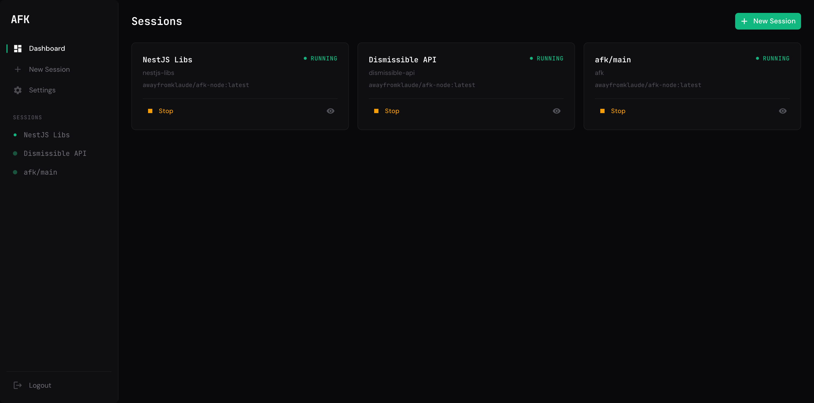
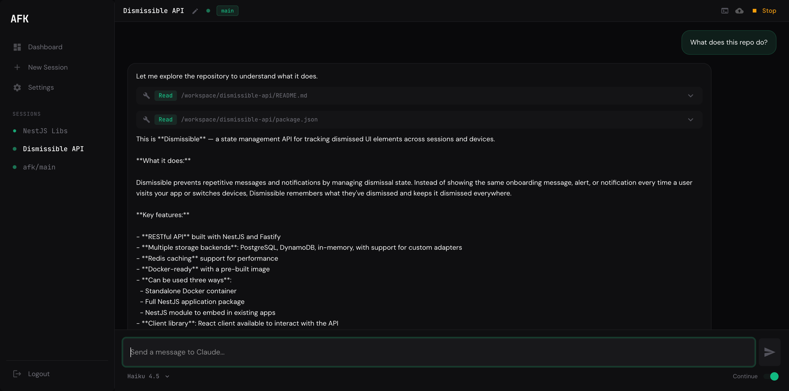
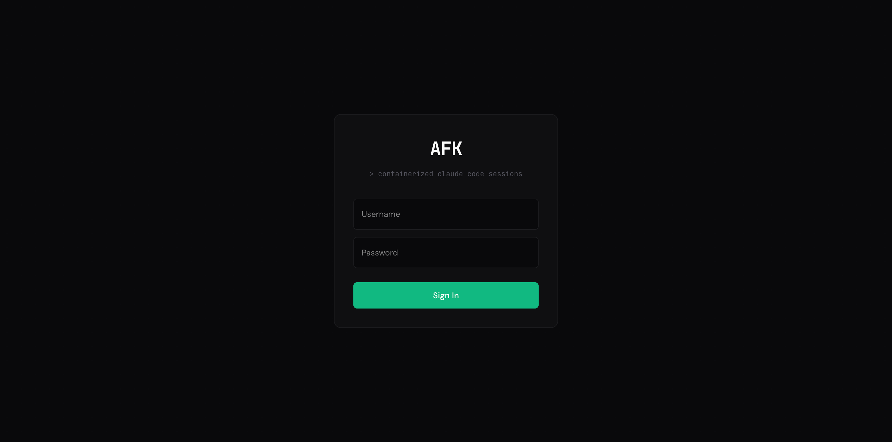
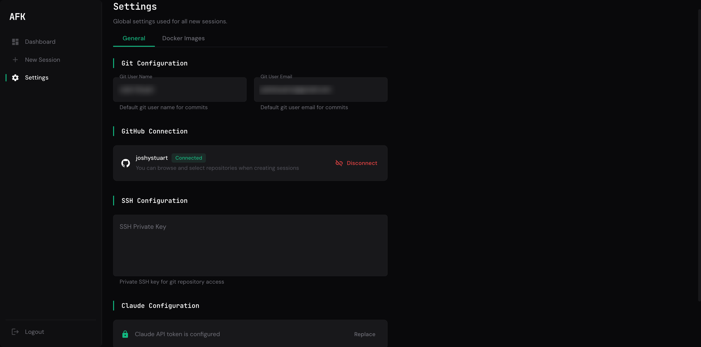
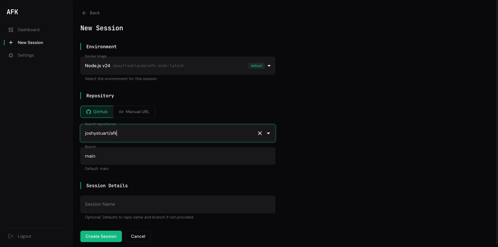
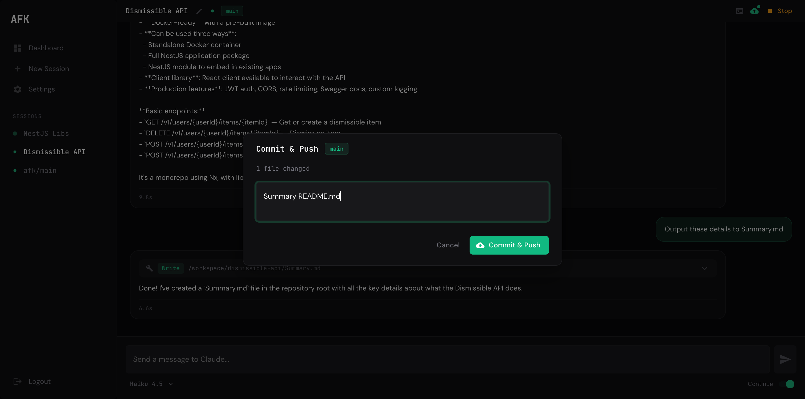

# AFK - Away From Klaude

AFK (Away From Klaude) lets you run multiple Claude Code sessions in isolated Docker environments for maximum safety, security and efficiency. Each session provides a chat pane for interacting with Claude Code and a web terminal for manual shell access, with chat history persisted across restarts.




## Quick Start

### Prerequisites

- Node.js 24+
- npm
- Docker (for container management)
- Claude CLI (for OAuth token generation)

### Installation

1. Clone the repository:

```bash
git clone https://github.com/joshystuart/afk.git
cd afk
```

2. Install dependencies and build:

```bash
npm run install:all
npm run build
```

3. Build the Docker images:

```bash
npm run docker:build
```

This builds a base image (`afk-base`) plus language-specific images for Node.js, Python, Go, Rust, .NET, and Java. See [docker/README.md](docker/README.md) for details.

4. Configure environment variables:

**Server Configuration:**

```bash
# Copy one of the platform-specific config files
cp server/src/config/.env.mac.yaml server/.env.yaml     # For macOS
# or
cp server/src/config/.env.windows.yaml server/.env.yaml  # For Windows
# or
cp server/src/config/.env.test.yaml server/.env.yaml     # For testing

# Edit server/.env.yaml with your configuration
```

**Web Client Configuration:**

```bash
# Copy the web environment file
cp web/.env.example web/.env
# Edit web/.env if you need to change API endpoints
```

5. Start the application:

```bash
# Development mode (hot reload)
npm run start:dev
```

- Web interface: [http://localhost:5173](http://localhost:5173)
- Server API: [http://localhost:3001](http://localhost:3001)
- Swagger API docs: [http://localhost:3001/api/docs](http://localhost:3001/api/docs)

```bash
# Production-like mode (built frontend preview + server start)
npm run build
npm run start
```

- Web interface: [http://localhost:4173](http://localhost:4173)
- Server API: [http://localhost:3001](http://localhost:3001)

### Getting Started

Log into the web interface using the admin credentials you set in `server/.env.yaml`:

- `http://localhost:5173` when using `npm run start:dev`
- `http://localhost:4173` when using `npm run build && npm run start`



Once the application is running you will need to ensure you have the following set up:

#### 1. Generate Claude OAuth Token

Before using AFK, you'll need to generate a Claude OAuth token: [https://code.claude.com/docs/en/setup](https://code.claude.com/docs/en/setup)

```bash
# Install Claude CLI if not already installed
curl -fsSL https://claude.ai/install.sh | bash

# Generate and set up your OAuth token
claude setup-token
```

This will guide you through the authentication process and store your token securely.

#### 2. Connect GitHub (Recommended)

The easiest way to give AFK access to your repositories is by connecting your GitHub account via OAuth. This lets you browse and select repos from a searchable dropdown when creating sessions, and handles private repo access automatically over HTTPS.

First, set up a [GitHub OAuth App](https://docs.github.com/en/apps/oauth-apps/building-oauth-apps/creating-an-oauth-app) and configure the credentials:

```bash
# Set these environment variables before starting the server
export GITHUB_CLIENT_ID="your-client-id"
export GITHUB_CLIENT_SECRET="your-client-secret"
```

Or add them directly to `server/.env.yaml`:

```yaml
github:
  clientId: 'your-client-id'
  clientSecret: 'your-client-secret'
  callbackUrl: 'http://localhost:3001/api/github/callback'
  frontendRedirectUrl: 'http://localhost:5173/settings'
```

Then connect your account through the web interface:

1. Go to **Settings** in the web interface
2. Click **Connect GitHub** in the GitHub Connection section
3. Authorize the application on GitHub
4. You'll be redirected back to Settings with a confirmation

Once connected, the Create Session page will default to a GitHub repository picker with search, recent repos, and auto-filled branch names.

#### 3. Set Up SSH Keys for Code Access (Alternative)

If you prefer SSH-based access or need to work with non-GitHub repositories, you can set up SSH keys instead:

```bash
# Generate a new SSH key specifically for AFK containers
ssh-keygen -t ed25519 -f ~/.ssh/afk_container_key -C "afk-container-access"

# Add the key to your SSH agent
ssh-add ~/.ssh/afk_container_key

# Add the public key to your GitHub/GitLab account
cat ~/.ssh/afk_container_key.pub
# Copy the output and add it to your Git provider's SSH keys
```

**Security Note:** Using a separate SSH key for container access provides better security isolation. This key can be easily revoked if needed without affecting your main development workflow.

**Note:** If you've connected GitHub, SSH keys are not required for GitHub repositories -- AFK will use your GitHub token for HTTPS cloning. SSH keys are still needed for non-GitHub repos accessed via SSH URLs.

Add your Claude token, Git identity, and (optionally) SSH key in the Settings page of the web interface.



#### Create a Session

To create a new session, click the "Create Session" button in the web interface. You can configure the session name, repository, and Docker image:

- **GitHub mode** (when connected): Browse your repositories with a searchable dropdown. Repos from previous sessions appear at the top under "Recent". Selecting a repo auto-fills the clone URL and default branch.
- **Manual URL mode**: Enter any git repository URL (SSH or HTTPS) and branch manually.
- **Docker image**: Choose from built-in language images (Node.js, Python, Go, Rust, .NET, Java) or any custom images you've registered.

The session will automatically start a Docker container with the specified settings and clone the provided repository.



#### Commit & Push from Session View

When a session is running, AFK continuously tracks git status for the checked-out repo and shows branch + change count in the session header.

To commit and push from the UI:



1. Open a running session
2. Click the **cloud upload** icon in the top status bar
3. Enter a commit message in the **Commit & Push** dialog
4. Submit to run `git add -A`, `git commit -m "<message>"`, and `git push` inside the session container

If no files have changed, the action is disabled automatically.

## Features

### Session Management

- Create and manage containerized development sessions
- Real-time session status updates via WebSocket
- Start, stop, and delete sessions
- Session lifecycle management with automatic cleanup
- Per-session Docker volumes for tmux state and Claude project context

### Docker Image Management

- Six built-in language images: Node.js (default), Python, Go, Rust, .NET, and Java
- Register custom Docker images through the API
- Set any image as the default for new sessions
- Image status tracking (available, pulling, error) with retry support
- All images extend from a common base with Claude Code, ttyd, git, and essential tools pre-installed

### Chat Interface

- Single chat pane per session for interacting with Claude Code
- Chat history persisted to the database and restored when sessions are restarted
- Streaming responses with real-time token output
- Tool call and thinking step visibility in the chat UI
- Claude's project context (`.claude/`) stored in a Docker volume, surviving stop/start cycles
- Cancel running Claude executions mid-stream
- Continue conversations across session restarts via `--continue`
- Web terminal available for manual shell access (opens in a new window)
- Responsive design for desktop and mobile

### GitHub Integration

- Connect your GitHub account via OAuth
- Browse and search your repositories from a searchable dropdown
- Recent repos from past sessions surfaced at the top
- Private repository access via HTTPS token (no SSH key required)
- Auto-filled clone URLs and default branch names

### Git Workflow

- Real-time git status (branch + changed file count) in session view
- One-click Commit & Push dialog from the session header
- Git user name/email from Settings used as defaults for new sessions
- Git operations run inside the isolated session container

### Settings

- Claude OAuth token management
- Git identity (name and email)
- SSH private key for non-GitHub repositories
- GitHub OAuth connection

## Project Structure

```
afk/
├── server/             # NestJS backend API
│   └── src/
│       ├── config/     # Typed configuration with nest-typed-config
│       ├── domain/     # Entities, repositories (sessions, chat, docker images, settings)
│       ├── gateways/   # WebSocket gateway for real-time updates
│       ├── interactors/ # Controllers and business logic
│       └── services/   # Docker engine, Claude execution, git watcher
├── web/                # React frontend application (Vite)
│   └── src/
│       ├── api/        # API client and types
│       ├── components/ # Reusable UI components
│       ├── hooks/      # Custom React hooks
│       ├── pages/      # Route pages (login, dashboard, session, settings)
│       └── stores/     # Zustand state stores
├── docker/             # Docker images
│   ├── base/           # Base image (Debian + Claude Code + ttyd + tools)
│   ├── node/           # Node.js 24 + yarn + pnpm
│   ├── python/         # Python 3.13 + pip + poetry
│   ├── go/             # Go 1.26
│   ├── rust/           # Rust (via rustup)
│   ├── dotnet/         # .NET 10
│   ├── java/           # Java 21 (Temurin) + Gradle 9.4 + Maven 3.9
│   └── scripts/        # Container entrypoint and setup scripts
├── docs/               # Screenshots and documentation assets
└── package.json        # Root package with scripts
```

## Development

### Available Scripts

From the root directory:

- `npm run start:dev` - Start both server and web client in development mode
- `npm run start` - Start both applications in production mode
- `npm run install:all` - Install dependencies for all packages
- `npm run build` - Build server and web client
- `npm run docker:build` - Build all Docker images (base + language)
- `npm run lint` - Run linting on both server and web
- `npm run test` - Run server tests
- `npm run format` - Format all files with Prettier
- `npm run format:check` - Check formatting without making changes
- `npm run web:storybook` - Launch Storybook for web component development

### Server Scripts

```bash
cd server
npm run start:dev    # Development with hot reload
npm run start        # Production mode
npm run build        # Build for production
npm run test         # Run tests
npm run lint         # Run ESLint
```

### Web Client Scripts

```bash
cd web
npm run dev          # Development server
npm run build        # Build for production
npm run preview      # Preview production build
npm run lint         # Run ESLint
npm run storybook    # Component development with Storybook
```

### Docker Image Scripts

```bash
cd docker
make all             # Build base + all language images
make base            # Build the base image only
make node            # Build afk-node image
make python          # Build afk-python image
make go              # Build afk-go image
make rust            # Build afk-rust image
make dotnet          # Build afk-dotnet image
make java            # Build afk-java image
make clean           # Remove all afk images
```

### Code Formatting

This project uses Prettier for consistent code formatting. Configuration is defined in `.prettierrc`.

```bash
# Format all files
npm run format

# Check formatting without making changes
npm run format:check
```

Prettier is configured with:

- Single quotes for strings
- Trailing commas
- 2-space indentation
- 80-character line width
- Semicolons required

## Configuration

### Server Configuration

Configure the server by creating `server/.env.yaml` from one of the provided templates:

```yaml
# Example server/.env.yaml
port: 3001
nodeEnv: development
baseUrl: http://localhost

docker:
  socketPath: '${DOCKER_HOST:-/var/run/docker.sock}'
  startPort: 7681
  endPort: 7780

logger:
  level: debug
  prettyPrint: true

session:
  maxSessionsPerUser: 10

adminUser:
  username: '${ADMIN_USERNAME:-admin}'
  password: '${ADMIN_PASSWORD:-password123}'

auth:
  jwtSecret: '${AUTH_JWT_SECRET:-afk-development-secret-key-change-in-production}'

# Optional: GitHub OAuth for repository browsing
github:
  clientId: '${GITHUB_CLIENT_ID:-}'
  clientSecret: '${GITHUB_CLIENT_SECRET:-}'
  callbackUrl: '${GITHUB_CALLBACK_URL:-http://localhost:3001/api/github/callback}'
  frontendRedirectUrl: '${GITHUB_FRONTEND_REDIRECT_URL:-http://localhost:5173/settings}'
```

**Available template configurations:**

- `server/src/config/.env.mac.yaml` - macOS-specific settings
- `server/src/config/.env.windows.yaml` - Windows-specific settings
- `server/src/config/.env.local-docker.yaml` - Local Docker settings
- `server/src/config/.env.test.yaml` - Test environment settings

You can use environment variables in the YAML file (e.g., `"${ADMIN_PASSWORD:-defaultvalue}"`).

### Web Client Configuration

Configure the web client by editing `web/.env`:

```bash
# API endpoints
VITE_API_URL=http://localhost:3001/api
VITE_WS_URL=http://localhost:3001
```

The web client uses Vite, so all environment variables must be prefixed with `VITE_`.

## Architecture

- **Backend**: NestJS 11 with TypeScript, SQLite database (TypeORM), WebSocket support (Socket.io)
- **Frontend**: React 19 with TypeScript, Material-UI 7, TanStack React Query, Zustand, Framer Motion
- **Container Management**: Dockerode for programmatic Docker integration, per-session containers with named volumes
- **Real-time Updates**: WebSocket gateway for session status, chat streaming, container logs, and git status
- **Authentication**: JWT-based single admin user authentication
- **API Documentation**: Swagger/OpenAPI available at `/api/docs`

## Contributing

1. Fork the repository
2. Create a feature branch: `git checkout -b feature/my-feature`
3. Make your changes and test them
4. Run linting: `npm run lint`
5. Run tests: `npm run test`
6. Commit your changes: `git commit -am 'Add my feature'`
7. Push to the branch: `git push origin feature/my-feature`
8. Submit a pull request

## License

This project is licensed under the MIT License - see the LICENSE file for details.

## Issues

If you encounter any issues or have feature requests, please create an issue on GitHub.
