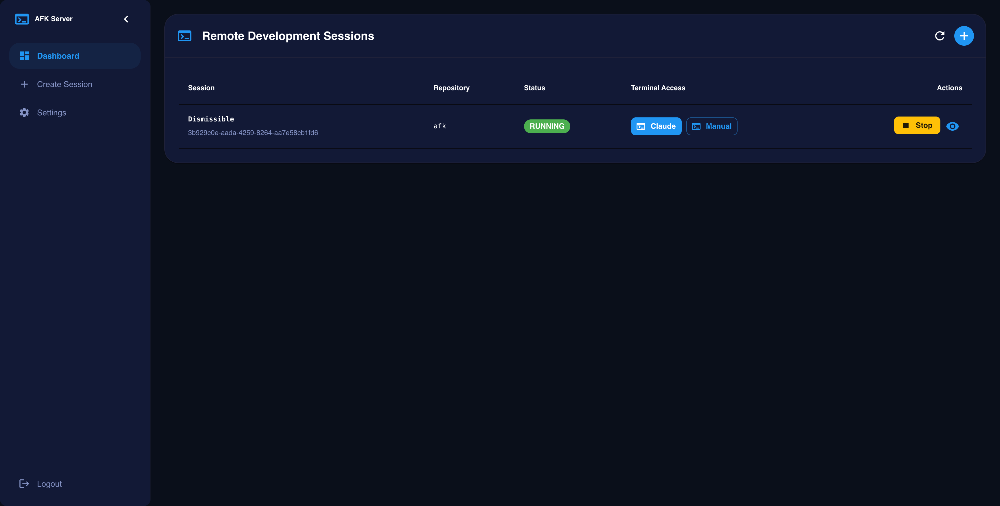
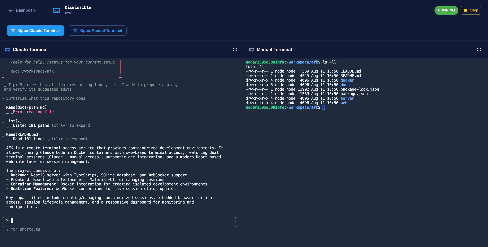
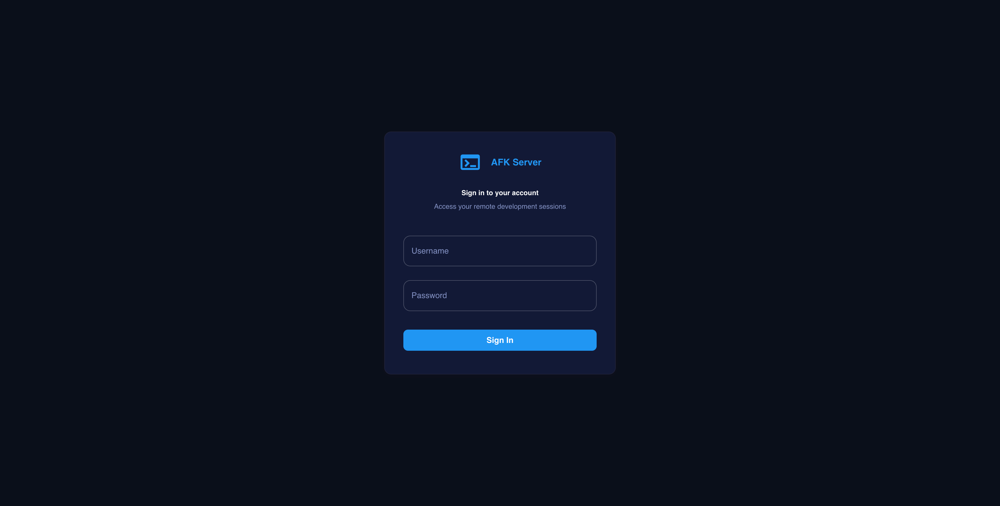
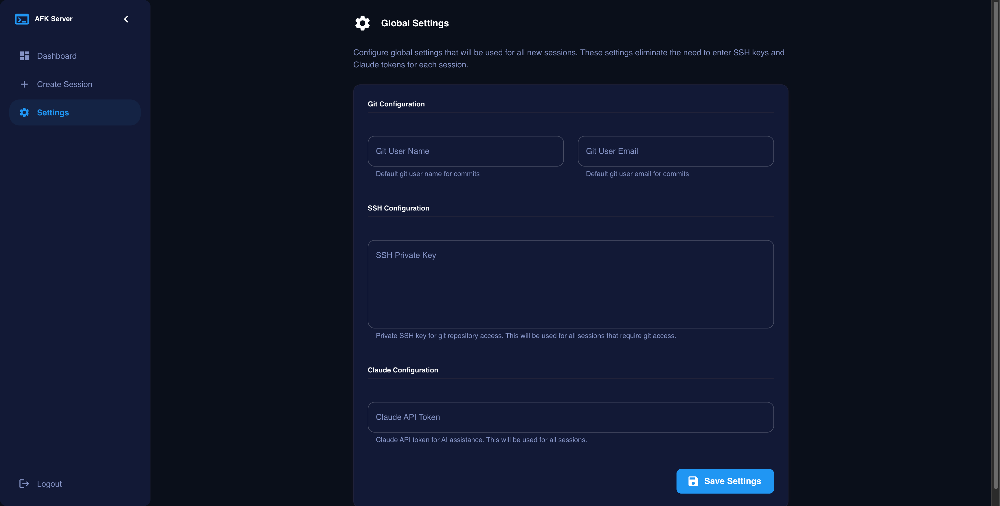
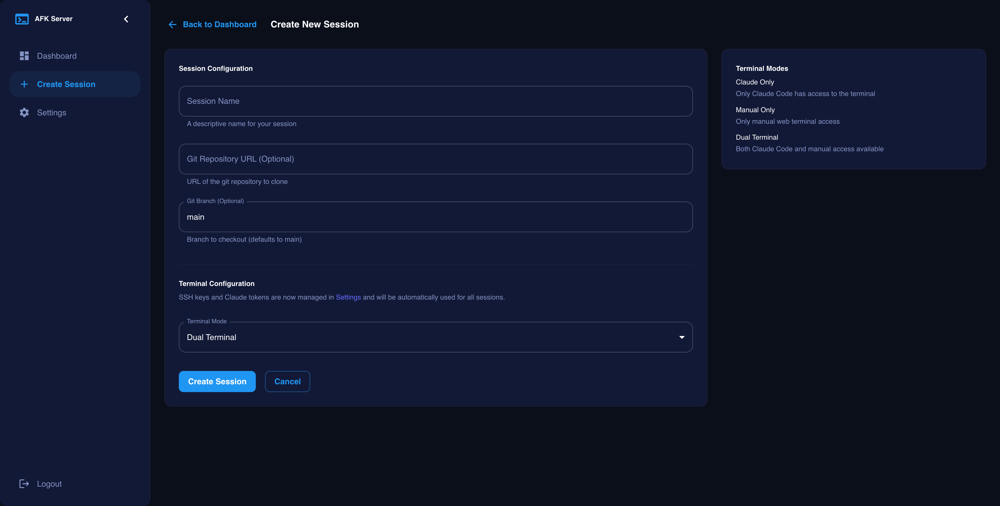

# AFK - Away From Klaude

AFK is a remote terminal access service that enables running Claude Code in Docker containers with web-based terminal access. The project provides containerized development environments with dual terminal sessions (Claude + manual access), automatic git integration, and a modern web interface for session management.





## 🚀 Quick Start

### Prerequisites

- Node.js 18+
- npm or yarn
- Docker (for container management)
- Claude CLI (for OAuth token generation)

### Installation

1. Clone the repository:

```bash
git clone https://github.com/joshystuart/afk.git
cd afk
```

2. Install dependencies:

```bash
npm run init
```

This will:

- Install dependencies for both the server and web client
- Build the server and web client applications
- Pull the Docker image to be able to run sessions

3. Configure environment variables:

**Server Configuration:**

```bash
# Copy one of the platform-specific config files
cp server/src/config/.env.mac.yaml server/.env.yaml     # For macOS
# or
cp server/src/config/.env.test.yaml server/.env.yaml    # For testing/other platforms

# Edit server/.env.yaml with your configuration
```

**Web Client Configuration:**

```bash
# Copy the web environment file
cp web/.env.example web/.env
# Edit web/.env if you need to change API endpoints
```

4. Start the application:

The web interface will be available at [http://localhost:5173](http://localhost:5173).
The server API will be available at [http://localhost:3001](http://localhost:3001).

```bash
# Development mode (both server and web client will hot reload)
npm run start:dev
```

The web interface will be available at [http://localhost:4173](http://localhost:4173)
The server API will be available at [http://localhost:3001](http://localhost:3001).

```bash
npm run start
```

### Getting Started

Log into the web interface at [http://localhost:4173](http://localhost:4173) using the admin credentials you set in `server/.env.yaml`:



Once the application is running you will need to ensure you have the following set up:

#### 1. Generate Claude OAuth Token

Before using AFK, you'll need to generate a Claude OAuth token:

```bash
# Install Claude CLI if not already installed
npm install -g @anthropic-ai/claude-cli

# Generate and set up your OAuth token
claude setup-token
```

This will guide you through the authentication process and store your token securely.

#### 2. Connect GitHub (Recommended)

The easiest way to give AFK access to your repositories is by connecting your GitHub account via OAuth. This lets you browse and select repos from a searchable dropdown when creating sessions, and handles private repo access automatically over HTTPS.

First, set up a [GitHub OAuth App](https://docs.github.com/en/apps/oauth-apps/building-oauth-apps/creating-an-oauth-app) and configure the credentials:

```bash
# Set these environment variables before starting the server
export GITHUB_CLIENT_ID="your-client-id"
export GITHUB_CLIENT_SECRET="your-client-secret"
# Optional: override the callback URL (defaults to http://localhost:3001/api/github/callback)
export GITHUB_CALLBACK_URL="http://localhost:3001/api/github/callback"
```

Or add them directly to `server/.env.yaml`:

```yaml
github:
  clientId: "your-client-id"
  clientSecret: "your-client-secret"
  callbackUrl: "http://localhost:3001/api/github/callback"
```

Then connect your account through the web interface:

1. Go to **Settings** in the web interface
2. Click **Connect GitHub** in the GitHub Connection section
3. Authorize the application on GitHub
4. You'll be redirected back to Settings with a confirmation

Once connected, the Create Session page will default to a GitHub repository picker with search, recent repos, and auto-filled branch names.

#### 3. Set Up SSH Keys for Code Access (Alternative)

If you prefer SSH-based access or need to work with non-GitHub repositories, you can set up SSH keys instead:

```bash
# Generate a new SSH key specifically for AFK containers
ssh-keygen -t ed25519 -f ~/.ssh/afk_container_key -C "afk-container-access"

# Add the key to your SSH agent
ssh-add ~/.ssh/afk_container_key

# Add the public key to your GitHub/GitLab account
cat ~/.ssh/afk_container_key.pub
# Copy the output and add it to your Git provider's SSH keys
```

**Security Note:** Using a separate SSH key for container access provides better security isolation. This key can be easily revoked if needed without affecting your main development workflow.

**Note:** If you've connected GitHub, SSH keys are not required for GitHub repositories -- AFK will use your GitHub token for HTTPS cloning. SSH keys are still needed for non-GitHub repos accessed via SSH URLs.

Add your Claude token and (optionally) SSH key in the settings page of the web interface.



#### Create a Session

To create a new session, click the "Create Session" button in the web interface. You can configure the session name and repository:

- **GitHub mode** (when connected): Browse your repositories with a searchable dropdown. Repos from previous sessions appear at the top under "Recent". Selecting a repo auto-fills the clone URL and default branch.
- **Manual URL mode**: Enter any git repository URL (SSH or HTTPS) and branch manually.

The session will automatically start a Docker container with the specified settings and clone the provided repository.



## 📁 Project Structure

```
afk/
├── server/         # NestJS backend API
├── web/            # React frontend application
├── docker/         # Docker image
├── docs/           # Project documentation
└── package.json    # Root package with scripts
```

## 🛠 Development

### Available Scripts

From the root directory:

- `npm run dev` - Start both server and web client in development mode
- `npm run start` - Start both applications in production mode
- `npm run install:all` - Install dependencies for all packages
- `npm run lint` - Run linting on both server and web
- `npm run test` - Run server tests
- `npm run format` - Format all files with Prettier
- `npm run format:check` - Check if files are formatted correctly

### Server Scripts

```bash
cd server
npm run start:dev    # Development with hot reload
npm run start        # Production mode
npm run build        # Build for production
npm run test         # Run tests
npm run lint         # Run ESLint
```

### Web Client Scripts

```bash
cd web
npm run dev          # Development server
npm run build        # Build for production
npm run preview      # Preview production build
npm run lint         # Run ESLint
```

### Code Formatting

This project uses Prettier for consistent code formatting. Configuration is defined in `.prettierrc`.

```bash
# Format all files
npm run format

# Check formatting without making changes
npm run format:check
```

Prettier is configured with:

- Single quotes for strings
- Trailing commas
- 2-space indentation
- 80-character line width
- Semicolons required

## ⚙️ Configuration

### Server Configuration

Configure the server by creating `server/.env.yaml` from one of the provided templates:

```yaml
# Example server/.env.yaml (based on .env.mac.yaml)
port: 3001
nodeEnv: development
baseUrl: http://localhost

docker:
  socketPath: '${DOCKER_HOST:-/var/run/docker.sock}'
  imageName: afk:latest
  startPort: 7681
  endPort: 7780

logger:
  level: debug
  prettyPrint: true

session:
  maxSessionsPerUser: 10
  sessionTimeoutMinutes: 60
  healthCheckIntervalSeconds: 30

adminUser:
  username: '${ADMIN_USERNAME:-admin}'
  password: '${ADMIN_PASSWORD:-password123}'

# Optional: GitHub OAuth for repository browsing
github:
  clientId: '${GITHUB_CLIENT_ID:-}'
  clientSecret: '${GITHUB_CLIENT_SECRET:-}'
  callbackUrl: '${GITHUB_CALLBACK_URL:-http://localhost:3001/api/github/callback}'
```

**Available template configurations:**

- `server/src/config/.env.mac.yaml` - macOS-specific settings
- `server/src/config/.env.test.yaml` - Test environment settings
- `server/src/config/.env.windows.yaml` - Windows-specific settings

You can use environment variables in the YAML file (e.g., `"${ADMIN_PASSWORD:-defaultvalue}"`).

### Web Client Configuration

Configure the web client by editing `web/.env`:

```bash
# API endpoints
VITE_API_URL=http://localhost:3001/api
VITE_WS_URL=http://localhost:3001
```

The web client uses Vite, so all environment variables must be prefixed with `VITE_`.

## 🏗 Architecture

- **Backend**: NestJS with TypeScript, SQLite database, WebSocket support
- **Frontend**: React with TypeScript, Material-UI, React Query
- **Container Management**: Docker integration for session containers
- **Real-time Updates**: WebSocket connections for session status

## 📋 Features

### Session Management

- Create and manage containerized development sessions
- Real-time session status updates via WebSocket
- Start, stop, restart, and delete sessions
- Session lifecycle management with automatic cleanup

### GitHub Integration

- Connect your GitHub account via OAuth
- Browse and search your repositories from a searchable dropdown
- Recent repos from past sessions surfaced at the top
- Private repository access via HTTPS token (no SSH key required)
- Auto-filled clone URLs and default branch names

### Terminal Access

- Embedded terminal access in the browser
- Support for multiple terminal modes (debug, dual, normal)
- External terminal access in new windows
- Responsive design for desktop and mobile

### Web Interface

- Modern React-based dashboard
- Real-time session monitoring
- Session creation and configuration
- Settings management

## 🤝 Contributing

1. Fork the repository
2. Create a feature branch: `git checkout -b feature/my-feature`
3. Make your changes and test them
4. Run linting: `npm run lint`
5. Run tests: `npm run test`
6. Commit your changes: `git commit -am 'Add my feature'`
7. Push to the branch: `git push origin feature/my-feature`
8. Submit a pull request

## 📄 License

This project is licensed under the MIT License - see the LICENSE file for details.

## 🐛 Issues

If you encounter any issues or have feature requests, please create an issue on GitHub.
