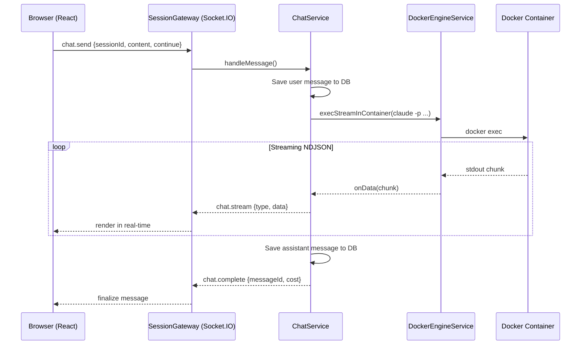

# Chat-Focused AFK Redesign

## Architecture Overview



## Key Design Decisions

- **Claude execution**: Use `claude -p "prompt" --output-format stream-json --dangerouslySkipPermissions` via the existing `execStreamInContainer()` method in [docker-engine.service.ts](server/src/services/docker/docker-engine.service.ts). This is already built for streaming exec output.
- **Conversation continuity**: Append `--continue` for same-conversation, omit for fresh. Store the conversation ID from Claude's result event to support `--resume` later.
- **Chat persistence**: New `ChatMessage` TypeORM entity stored in SQLite alongside sessions.
- **Manual terminal**: Keep a single ttyd instance in the container. Frontend provides an "Open Terminal" button that calls `window.open(terminalUrl)`. No terminal is embedded in the app.
- **Ports**: Keep allocating 2 ports for backward compatibility but only use the manual port for ttyd. The Claude port is no longer needed (execution happens via `docker exec`). Can optimize to 1 port later.

## Things You May Have Missed

1. **Cancellation**: Users need a way to cancel a running Claude prompt mid-execution. The `execStreamInContainer` already returns a `kill()` function we can wire to a "Stop" button.
2. **Concurrent execution guard**: Only one Claude prompt should run per session at a time. The input should be disabled while Claude is processing, with a clear "thinking/working" indicator.
3. **NDJSON stream parsing**: Claude outputs newline-delimited JSON. Chunks from Docker exec may split across JSON boundaries, so we need a line-buffered parser to handle partial lines.
4. **Environment variable**: Need to add `CLAUDE_DANGEROUS_SKIP_PERMISSIONS=1` (or equivalent) to the container environment so the `--dangerouslySkipPermissions` flag works without prompting.
5. **Health check changes**: Currently checks both Claude and manual terminal ports. Needs updating to only check the manual terminal port (or just check container is running).
6. **Working directory**: `claude -p` needs the correct `--cwd` or needs to be run from the repo directory. The `execStreamInContainer` already accepts a `workingDir` parameter.

---

## Layer 1: Docker Image and Startup Script

### [docker/scripts/entrypoint.sh](docker/scripts/entrypoint.sh)

- Remove the `claude-session` tmux session and its ttyd instance
- Keep `manual-session` tmux + ttyd (single instance, foreground, on `MANUAL_PORT`)
- Claude is no longer started at boot; it is invoked on-demand via `docker exec`
- Keep SSH setup, git clone, and git identity configuration unchanged

### [docker/Dockerfile](docker/Dockerfile)

- No structural changes needed. Claude CLI is already installed and on PATH.
- Consider adding `ENV CLAUDE_DANGEROUS_SKIP_PERMISSIONS=1` if needed

### [server/src/services/docker/docker-engine.service.ts](server/src/services/docker/docker-engine.service.ts)

- Add `CLAUDE_DANGEROUS_SKIP_PERMISSIONS=1` to `buildEnvironment()`
- No other changes needed; `execStreamInContainer()` (line 265) already does exactly what we need

---

## Layer 2: Backend -- New Chat Domain and Service

### New entity: `server/src/domain/chat/chat-message.entity.ts`

```typescript
@Entity('chat_messages')
export class ChatMessage {
  @PrimaryColumn('varchar', { length: 36 })
  id: string;

  @Column('varchar', { length: 36 })
  sessionId: string;

  @Column('varchar')
  role: 'user' | 'assistant';

  @Column('text')
  content: string;

  @Column('json', { nullable: true })
  streamEvents: any[]; // raw stream-json events for re-rendering

  @Column('varchar', { nullable: true })
  conversationId: string | null; // Claude's conversation ID

  @Column('boolean', { default: false })
  isContinuation: boolean;

  @Column('float', { nullable: true })
  costUsd: number | null;

  @Column('int', { nullable: true })
  durationMs: number | null;

  @CreateDateColumn()
  createdAt: Date;
}
```

### New service: `server/src/services/chat/chat.service.ts`

- `sendMessage(sessionId, content, options: { continue: boolean })`: Orchestrates the full flow:
  1. Look up session and validate it's RUNNING with a container
  2. Save user `ChatMessage` to DB
  3. Build CLI args: `['claude', '-p', content, '--output-format', 'stream-json', '--dangerouslySkipPermissions']` + optional `--continue` or `--resume <id>`
  4. Call `dockerEngine.execStreamInContainer(containerId, cmd, onData, workingDir)`
  5. Buffer and parse NDJSON lines, emit parsed events via callback
  6. On completion, save assistant `ChatMessage` with full stream events, cost, duration
  7. Return a `kill()` function for cancellation
- `getHistory(sessionId)`: Return all `ChatMessage` records for a session, ordered by `createdAt`
- Track active executions per session (Map) to prevent concurrent runs and support cancellation

### New NDJSON parser utility: `server/src/services/chat/ndjson-parser.ts`

- Line-buffered parser that handles partial chunks from Docker exec streaming
- Emits parsed JSON objects one at a time

---

## Layer 3: Backend -- WebSocket and REST API

### Extend [session.gateway.ts](server/src/gateways/session.gateway.ts)

New WebSocket events:

| Direction        | Event           | Payload                                                         |
| ---------------- | --------------- | --------------------------------------------------------------- |
| Client -> Server | `chat.send`     | `{ sessionId, content, continue: boolean }`                     |
| Server -> Client | `chat.stream`   | `{ sessionId, messageId, event: {...} }`                        |
| Server -> Client | `chat.complete` | `{ sessionId, messageId, conversationId, costUsd, durationMs }` |
| Server -> Client | `chat.error`    | `{ sessionId, messageId, error }`                               |
| Client -> Server | `chat.cancel`   | `{ sessionId }`                                                 |

### New REST endpoint (on sessions controller)

- `GET /api/sessions/:id/messages` -- returns chat history for session reload / initial page load

---

## Layer 4: Frontend -- Chat UI

### Replace terminal panels in [SessionDetails.tsx](web/src/pages/SessionDetails.tsx)

Remove the dual-iframe `TerminalPanel` rendering. Replace with a new `ChatPanel` component when session is RUNNING.

### New components

- `**ChatPanel**` -- main container: scrollable message list + input area. Manages WebSocket subscription for `chat.stream`, `chat.complete`, `chat.error`. Fetches history via REST on mount.
- `**ChatInput**` -- text area with Send button, "Continue conversation" toggle, disabled state while Claude is processing. Cancel button appears during execution.
- `**ChatMessageBubble**` -- renders a single message. For user messages: simple text bubble. For assistant messages: renders from stream events.
- `**ThinkingBlock**` -- collapsible block showing Claude's thinking (expanded by default while streaming, collapsed after completion).
- `**ToolCallBlock**` -- shows tool name, input summary, and result. Collapsible with syntax-highlighted details.
- `**StreamingIndicator**` -- animated indicator showing Claude is working (similar to typing indicators in chat apps).

### "Open Terminal" button

- Add a button in the session header/toolbar that calls `window.open(session.terminalUrls.manual, '_blank', 'popup,width=900,height=600')`.
- Only visible when session is RUNNING and terminal is healthy.

### New hooks

- `**useChat(sessionId)**` -- manages chat state: messages array, sending, streaming state, cancel function. Connects to WebSocket events and REST API.

---

## Layer 5: Cleanup and Migration

- Update `useSessionHealth` to only check manual terminal (not Claude terminal)
- Update `TerminalLoading` component or remove if no longer needed
- Remove Claude terminal iframe references from `SessionDetails.tsx`
- Update health check in `SessionLifecycleInteractor` to only check manual port
- The `PortPairDto` and `Session.getTerminalUrls()` still work; the `claude` URL just won't be used in the UI (keep for backward compat)
