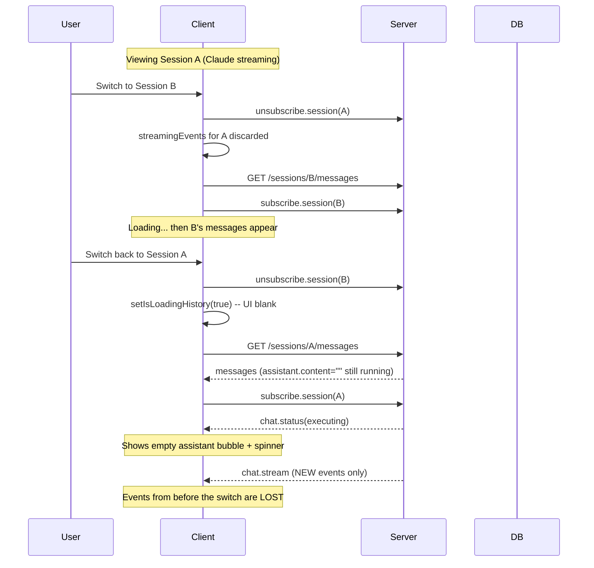

# Fix Session Switch Message Disappear/Reappear

## Root Cause Analysis

When you switch between sessions, the chat content disappears and partially reloads because of **three compounding issues**:

### 1. Immediate loading state wipes the UI

In `[web/src/hooks/useChat.ts](web/src/hooks/useChat.ts)` (line 38), `setIsLoadingHistory(true)` fires immediately on session change. `[ChatPanel.tsx](web/src/components/chat/ChatPanel.tsx)` (line 97) then renders a bare "Loading chat history..." text instead of any messages -- even if the previous session's data is still perfectly valid in state.

### 2. Zero client-side caching of chat messages

Messages live in `useState` inside `useChat`. There is no per-session cache. Every session switch triggers a fresh HTTP `GET /sessions/:id/messages`, and while that request is in-flight, the user sees nothing. Compare this to the session metadata which uses React Query (`['session', sessionId]`) and shows cached data instantly.

### 3. In-flight stream events are permanently lost on switch-away

This is the worst part. When Claude is actively streaming and you navigate away:

```
Session A (streaming) → switch to B → switch back to A
```

The sequence is:

1. **Switch away**: WebSocket cleanup runs, `streamingEvents` state is abandoned
2. **Switch back**: HTTP fetch returns the assistant message, but its `content` is empty (still in progress) and `streamEvents` is excluded from the summary endpoint
3. WebSocket reconnects, `chat.status` says "executing", new stream events start arriving
4. But **all previously-streamed events are gone** -- the user sees a spinner, then a partial stream missing everything from before the switch

The server IS archiving chunks to `chat_stream_chunks` during streaming, but this data is never sent back when a client re-subscribes to an active session.



---

## Proposed Fix Options

### Option A: Client-side message cache (quick win, client-only)

Move message fetching to React Query with `staleTime` so cached messages display instantly on switch-back. Keep streaming events in a per-session `Map` or Zustand store so they persist across navigations.

**What changes:**

- Refactor `useChat` to use React Query for `getChatHistory` with key `['chat', sessionId]`
- Set `staleTime: Infinity` (or a long duration) so cached messages render immediately while a background refetch runs
- Store `streamingEvents` per session in a `Map<sessionId, ChatStreamEvent[]>` ref or Zustand slice, so switching back restores the last-seen streaming state
- Keep the WebSocket logic as-is

**Pros:**

- Client-only change, no server work
- Instant switch-back for completed messages
- Streaming events from before the switch are shown from the cache

**Cons:**

- Cached stream state can become stale (events arrived on the server while the client was away are still missing)
- The gap between "cached streaming position" and "live stream position" means the user sees a jump when new events arrive

**Effort:** Small-medium

---

### Option B: Server-side stream replay on subscribe (most correct)

When a client subscribes to a session with an active execution, the server replays the archived chunks from `chat_stream_chunks` before continuing the live stream. This gives the client the full stream from the beginning.

**What changes:**

- In `[session.gateway.ts](server/src/gateways/session.gateway.ts)` `handleSessionSubscription`, after emitting `chat.status`, if there is an active execution:
  - Load archived chunks for the active `assistantMessageId` from `ChatStreamChunkRepository`
  - Emit a new `chat.replay` event (or batch of `chat.stream` events) with all historical events
  - The live stream continues as normal after the replay
- Client listens for the replay and merges events into state

**Pros:**

- Always correct -- no stale data, no gaps
- Client sees the full stream from the beginning, exactly as if they never left

**Cons:**

- More server work and increased load on subscribe (DB read + potentially large event replay)
- Need to handle ordering between replayed events and new live events (deduplication)
- Client-only loading state issue still exists unless combined with Option A

**Effort:** Medium

---

### Option C: Hybrid -- Client cache + Server replay (best UX)

Combine both approaches: client cache for instant visual feedback, server replay to fill any gaps.

**What changes:**

- **Client**: React Query cache for messages, per-session streaming event cache (Option A)
- **Server**: On subscribe with active execution, include the `streamEventCount` so far in the `chat.status` event. If the client's cached event count is behind, it requests a replay from a specific sequence number
- **Server**: New `chat.catchup` event or endpoint that returns archived events from sequence N onwards
- **Client**: Merges catch-up events with cached events, deduplicating by sequence

**Pros:**

- Best of both worlds: instant display + no data loss
- Incremental catch-up avoids replaying the entire stream

**Cons:**

- Most complex to implement
- Requires event sequence tracking on both sides

**Effort:** Medium-large

---

## Recommendation

I recommend **starting with Option A** as an immediate improvement, then layering on **Option B** (server replay). This gives you:

1. **Immediate win**: No more blank screen on session switch -- cached messages appear instantly
2. **Follow-up**: Server replay closes the gap for in-flight streams, ensuring no events are ever lost

Option A alone will resolve the most jarring part of the UX (messages disappearing entirely). Option B then handles the edge case of returning to an actively-streaming session with full fidelity.
