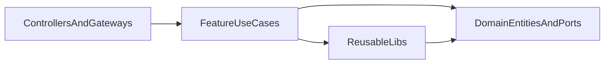

# Server Cleanup Plan

## Review Findings

- Reverse dependencies are the biggest architectural drift. Infrastructure modules under `[server/src/services/sessions/session-services.module.ts](server/src/services/sessions/session-services.module.ts)`, `[server/src/services/docker/docker.module.ts](server/src/services/docker/docker.module.ts)`, and `[server/src/services/scheduled-jobs/scheduled-jobs-services.module.ts](server/src/services/scheduled-jobs/scheduled-jobs-services.module.ts)` import `[server/src/interactors/settings/settings.module.ts](server/src/interactors/settings/settings.module.ts)`, and `[server/src/services/sessions/session-idle-cleanup.service.ts](server/src/services/sessions/session-idle-cleanup.service.ts)` depends directly on `[server/src/interactors/sessions/session-lifecycle.interactor.ts](server/src/interactors/sessions/session-lifecycle.interactor.ts)`. That makes lower-level code depend on use-case wiring.
- The websocket layer is coupled to interactor/presentation details. `[server/src/gateways/gateways.module.ts](server/src/gateways/gateways.module.ts)` imports `[server/src/interactors/scheduled-jobs/scheduled-jobs.module.ts](server/src/interactors/scheduled-jobs/scheduled-jobs.module.ts)`, and `[server/src/gateways/session.gateway.ts](server/src/gateways/session.gateway.ts)` imports scheduled-job DTO factories from `interactors` plus event constants from `[server/src/services/scheduled-jobs/job-executor.service.ts](server/src/services/scheduled-jobs/job-executor.service.ts)`.
- Cross-cutting utilities are registered repeatedly instead of exposed once. `[server/src/app.module.ts](server/src/app.module.ts)`, `[server/src/interactors/settings/settings.module.ts](server/src/interactors/settings/settings.module.ts)`, `[server/src/interactors/sessions/sessions.module.ts](server/src/interactors/sessions/sessions.module.ts)`, `[server/src/interactors/scheduled-jobs/scheduled-jobs.module.ts](server/src/interactors/scheduled-jobs/scheduled-jobs.module.ts)`, and `[server/src/libs/github/github.module.ts](server/src/libs/github/github.module.ts)` all provide `ResponseService`, and settings also wires `GitHubService` directly.
- Repository and domain boundaries are inconsistent. Settings uses a port/token plus implementation split (`[server/src/domain/settings/settings.repository.ts](server/src/domain/settings/settings.repository.ts)` and `[server/src/services/repositories/settings.repository.ts](server/src/services/repositories/settings.repository.ts)`), while sessions use a concrete repository directly in `[server/src/services/repositories/session.repository.ts](server/src/services/repositories/session.repository.ts)`.
- Several classes are doing too much and are hard to evolve safely: `[server/src/interactors/sessions/session-lifecycle.interactor.ts](server/src/interactors/sessions/session-lifecycle.interactor.ts)`, `[server/src/services/scheduled-jobs/job-executor.service.ts](server/src/services/scheduled-jobs/job-executor.service.ts)`, `[server/src/services/docker/docker-engine.service.ts](server/src/services/docker/docker-engine.service.ts)`, and `[server/src/gateways/session.gateway.ts](server/src/gateways/session.gateway.ts)`.
- Some feature code is still organized by technical type rather than use case. `[server/src/interactors/docker-images/docker-images.controller.ts](server/src/interactors/docker-images/docker-images.controller.ts)` talks straight to a service, while sessions and scheduled jobs use interactors; `[server/src/interactors/scheduled-jobs/scheduled-job-definition.service.ts](server/src/interactors/scheduled-jobs/scheduled-job-definition.service.ts)` contains domain construction logic inside `interactors`.

## Target Shape

- Keep `[server/src/libs](server/src/libs)` for reusable adapters and cross-cutting modules only: auth, github, response, logger, docker client abstractions, git, stream archive, shared event contracts.
- Keep `[server/src/domain](server/src/domain)` for entities, value objects, enums, and repository/service ports only.
- Keep feature-specific orchestration under `[server/src/interactors](server/src/interactors)` and organize it into vertical slices grouped by use case, for example:
  - `[server/src/interactors/sessions/create-session](server/src/interactors/sessions/create-session)`
  - `[server/src/interactors/sessions/start-session](server/src/interactors/sessions/start-session)`
  - `[server/src/interactors/scheduled-jobs/create-scheduled-job](server/src/interactors/scheduled-jobs/create-scheduled-job)`
  - `[server/src/interactors/settings/update-settings](server/src/interactors/settings/update-settings)`
- Eliminate the catch-all `[server/src/services](server/src/services)` folder over time by moving each file to either a reusable `libs` module or an `interactors/<feature>/<use-case>` slice.
- Keep controllers and gateways as transport adapters only; they should depend on use-case classes or small contracts, not on repository implementations, DTO factories from other adapters, or large orchestration services.

## Refactor Phases

### 1. Stabilize the dependency rules first

- Create a thin persistence/config module that exports `SETTINGS_REPOSITORY` without routing infrastructure through `[server/src/interactors/settings/settings.module.ts](server/src/interactors/settings/settings.module.ts)`.
- Stop infra and background jobs from importing `interactors`. The first fixes should target `[server/src/services/docker/docker.module.ts](server/src/services/docker/docker.module.ts)`, `[server/src/services/scheduled-jobs/scheduled-jobs-services.module.ts](server/src/services/scheduled-jobs/scheduled-jobs-services.module.ts)`, `[server/src/services/sessions/session-services.module.ts](server/src/services/sessions/session-services.module.ts)`, and `[server/src/services/sessions/session-idle-cleanup.service.ts](server/src/services/sessions/session-idle-cleanup.service.ts)`.
- Extract shared provider modules for `ResponseService` and GitHub integration so they are imported once instead of re-provided per feature.

### 2. Normalize feature boundaries before moving folders

- Introduce one consistent rule for repositories: domain defines the port/token, infrastructure implements it, use cases inject the port. Apply that pattern to sessions first by reshaping `[server/src/services/repositories/session.repository.ts](server/src/services/repositories/session.repository.ts)` to match the settings approach.
- Move feature-specific domain construction out of `interactors`, starting with `[server/src/interactors/scheduled-jobs/scheduled-job-definition.service.ts](server/src/interactors/scheduled-jobs/scheduled-job-definition.service.ts)`.
- Decide on a single depth for features: either every API action gets a use-case class or the feature is intentionally a thin adapter. The current docker-images flow should be aligned with the rest of the codebase.

### 3. Split the large coordinators by responsibility

- Break `[server/src/interactors/sessions/session-lifecycle.interactor.ts](server/src/interactors/sessions/session-lifecycle.interactor.ts)` into focused use cases such as `start-session`, `stop-session`, `delete-session`, and a smaller shared session runtime helper for container/log/git coordination.
- Break `[server/src/services/scheduled-jobs/job-executor.service.ts](server/src/services/scheduled-jobs/job-executor.service.ts)` into a pipeline of smaller collaborators: job-run creation/state updates, container provisioning, Claude execution, git post-processing, and event publishing.
- Break `[server/src/services/docker/docker-engine.service.ts](server/src/services/docker/docker-engine.service.ts)` into reusable Docker library pieces such as client factory, image management, container provisioning, and health/exec helpers.
- Split `[server/src/gateways/session.gateway.ts](server/src/gateways/session.gateway.ts)` by capability: subscriptions, logs, chat, and scheduled-job run streaming.

### 4. Decouple adapters from each other

- Remove gateway dependencies on interactor DTO factories by moving realtime payload mapping into a scheduled-jobs contract/factory owned by the feature or by the gateway adapter itself.
- Move `JOB_RUN_EVENTS` and similar transport-facing constants out of `[server/src/services/scheduled-jobs/job-executor.service.ts](server/src/services/scheduled-jobs/job-executor.service.ts)` into a small shared event contract module.
- Remove observability's direct dependency on gateways where possible; metrics should consume a narrow subscription interface or event stream instead of importing the full gateway module.

### 5. Reorganize incrementally into the target folder layout

- Migrate one feature at a time rather than renaming everything up front.
- Recommended order:

1. Settings and shared provider modules, because they unblock many reverse dependencies.
2. Scheduled jobs, because the gateway and service/interactor boundary is currently leaky but reasonably self-contained.
3. Sessions, because it has the heaviest orchestration and will benefit most from smaller use-case slices.
4. Docker and other reusable libraries, once their consumers are cleaner.

- After each slice migration, remove now-empty `services/*` segments rather than keeping aliases indefinitely.

### 6. Add guardrails so the architecture does not regress

- Add import-boundary checks so `libs` never import feature/use-case folders, gateways/controllers never import repository implementations, and infrastructure never imports `interactors`.
- Add a lightweight architecture document in the server package describing what belongs in `libs`, `domain`, and per-feature use-case folders under `interactors`.
- Prefer typed/domain-specific exceptions over `throw new Error(...)` plus repeated controller `try/catch` blocks, then centralize HTTP mapping with filters/interceptors.

## Suggested First Milestone

- Complete the dependency cleanup without moving every folder yet.
- Deliverables:
  - shared settings persistence module
  - shared response/github modules
  - no `services/**` imports from `interactors/**`
  - no `gateways/**` imports from interactor DTO/factory files
- Once that milestone is done, the remaining feature-by-feature moves become much safer and more mechanical.
