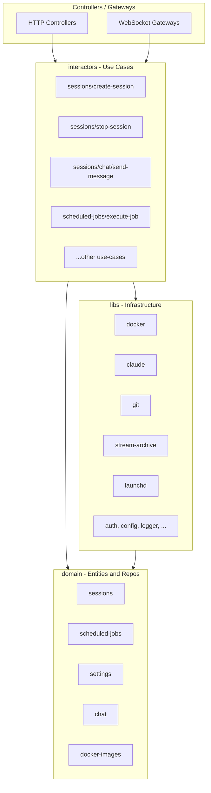

# Server Clean Architecture Refactor

## Problem Statement

The server has three top-level code directories -- `libs/`, `interactors/`, and `services/` -- but the `services/` directory has become a grab-bag that violates the intended convention:

- `**libs/**` should be reusable infrastructure (could be extracted to a package)
- `**interactors/**` should be domain use-cases that combine libs to perform business operations
- `**services/**` is a mix of both, with no clear boundary

Additionally, several controllers bypass interactors and call services directly, repositories are inconsistently placed, and a few files exceed the 500-line guideline.

---

## Current Architecture Issues

### 1. `services/` contains both infrastructure and domain logic

**Infrastructure (should be `libs/`):**

- `DockerEngineService` (457 lines) -- Docker API wrapper
- `PortManagerService` (173 lines) -- port pool allocation
- `ContainerLogStreamService` (221 lines) -- log stream multiplexing
- `GitService` (186 lines) -- git CLI over Docker exec
- `ClaudeStreamRunnerService` (222 lines) -- Claude CLI execution
- `NdjsonParser` -- stream parsing utility
- `ClaudeEventArchiveService` (216 lines) -- stream persistence
- `LaunchdService` (227 lines) -- macOS LaunchAgent management

**Domain logic (should be `interactors/`):**

- `ChatService` (264 lines) -- send/cancel/load chat messages
- `JobExecutorService` (384 lines) -- execute a scheduled job
- `JobSchedulerService` (176 lines) -- register/unregister jobs with Nest scheduler
- `ScheduledJobTimingService` (33 lines) -- compute next run time
- `SessionIdleCleanupService` (89 lines) -- idle session timeout
- `GitWatcherService` (192 lines) -- watch git changes per session
- `DockerImageService` (312 lines) -- manage Docker images

**Cross-cutting (should be `libs/`):**

- `StartupReconciliationService` (189 lines) -- startup consistency
- `ServerMetricsService` (86 lines) -- metrics aggregation

### 2. Repositories are split inconsistently

- `services/repositories/session.repository.ts` -- concrete class, no interface
- `services/repositories/settings.repository.ts` -- implements interface from `domain/settings/`
- Domain repositories (`ScheduledJobRepository`, `ChatMessageRepository`, etc.) live in `domain/` as concrete classes

### 3. Controllers bypass interactors

- `[interactors/docker-images/docker-images.controller.ts](server/src/interactors/docker-images/docker-images.controller.ts)` (238 lines) -- calls `DockerImageService` directly, no interactors at all
- `[interactors/sessions/chat-messages.controller.ts](server/src/interactors/sessions/chat-messages.controller.ts)` -- calls `ChatService` directly
- `[interactors/sessions/get-chat-message-stream.controller.ts](server/src/interactors/sessions/get-chat-message-stream.controller.ts)` -- calls `ChatService` directly
- `[interactors/scheduled-jobs/get-scheduled-job-run-stream.controller.ts](server/src/interactors/scheduled-jobs/get-scheduled-job-run-stream.controller.ts)` -- calls repository and archive service directly

### 4. Oversized files


| File                                                               | Lines | Issue                                                            |
| ------------------------------------------------------------------ | ----- | ---------------------------------------------------------------- |
| `gateways/session.gateway.ts`                                      | 615   | Handles sessions, logs, chat, git, job runs -- too many concerns |
| `services/docker/docker-engine.service.ts`                         | 457   | Many Docker operations, approaching limit                        |
| `interactors/sessions/session-lifecycle.interactor.ts`             | 451   | Mixes stop/start/delete/health                                   |
| `services/scheduled-jobs/job-executor.service.ts`                  | 384   | Complex orchestration                                            |
| `interactors/sessions/create-session/create-session.interactor.ts` | 320   | Could extract validation/config steps                            |


### 5. `SessionLifecycleInteractor` violates SRP

This 451-line class handles stop, start, delete, health check, AND read-only `getSessionInfo`. It's used as a god-object by multiple controllers.

---

## Proposed Architecture




### Directory structure after refactor

```
server/src/
├── domain/                          # Entities, repos, value objects (mostly unchanged)
│   ├── chat/
│   ├── containers/
│   ├── docker-images/
│   ├── scheduled-jobs/
│   ├── sessions/
│   │   ├── session.entity.ts
│   │   ├── session.repository.ts    # MOVED from services/repositories/
│   │   └── ...
│   └── settings/
│       ├── settings.entity.ts
│       ├── settings.repository.ts   # interface (already here)
│       ├── settings-repository.impl.ts  # MOVED from services/repositories/
│       └── ...
│
├── libs/                            # Reusable infrastructure
│   ├── auth/                        # (unchanged)
│   ├── claude/                      # NEW: Claude CLI execution
│   │   ├── claude-stream-runner.service.ts  # FROM services/chat/
│   │   ├── ndjson-parser.ts                 # FROM services/chat/
│   │   └── claude.module.ts
│   ├── common/                      # (unchanged)
│   ├── config/                      # (unchanged)
│   ├── decorators/                  # (unchanged)
│   ├── docker/                      # EXPANDED: all Docker infra
│   │   ├── docker-engine.service.ts         # FROM services/docker/
│   │   ├── container-log-stream.service.ts  # FROM services/docker/
│   │   ├── port-manager.service.ts          # FROM services/docker/
│   │   ├── container-not-found.error.ts     # FROM services/docker/
│   │   └── docker.module.ts
│   ├── git/                         # MOVED from services/git/
│   │   ├── git.service.ts
│   │   └── git.module.ts
│   ├── github/                      # (unchanged)
│   ├── launchd/                     # MOVED from services/scheduled-jobs/
│   │   ├── launchd.service.ts
│   │   └── launchd.module.ts
│   ├── logger/                      # (unchanged)
│   ├── observability/               # MOVED: startup reconciliation + metrics
│   │   ├── startup-reconciliation.service.ts
│   │   ├── server-metrics.service.ts
│   │   ├── metrics.controller.ts
│   │   └── observability.module.ts
│   ├── response/                    # (unchanged)
│   ├── stream-archive/              # MOVED from services/stream-archive/
│   │   ├── claude-event-archive.service.ts
│   │   └── stream-archive.module.ts
│   └── validators/                  # (unchanged)
│
├── interactors/                     # Use-case groups
│   ├── docker-images/
│   │   ├── create-docker-image/     # NEW: extracted from controller
│   │   ├── delete-docker-image/
│   │   ├── install-docker-image/
│   │   ├── list-docker-images/
│   │   ├── docker-image.service.ts  # MOVED from services/docker/
│   │   └── docker-images.module.ts
│   ├── scheduled-jobs/
│   │   ├── create-scheduled-job/    # (unchanged)
│   │   ├── update-scheduled-job/    # (unchanged)
│   │   ├── delete-scheduled-job/    # (unchanged)
│   │   ├── trigger-scheduled-job/   # (unchanged)
│   │   ├── execute-job/             # MOVED: JobExecutorService
│   │   ├── schedule-jobs/           # MOVED: JobSchedulerService
│   │   ├── list-scheduled-jobs/     # (unchanged)
│   │   ├── get-scheduled-job/
│   │   ├── get-job-run-stream/      # NEW: extracted from controller
│   │   ├── clear-all-scheduled-jobs/
│   │   ├── scheduled-job-timing.service.ts  # MOVED from services/
│   │   └── scheduled-jobs.module.ts
│   ├── sessions/
│   │   ├── create-session/          # (unchanged)
│   │   ├── start-session/           # NEW: extracted from lifecycle
│   │   ├── stop-session/            # NEW: extracted from lifecycle
│   │   ├── delete-session/          # NEW: extracted from lifecycle
│   │   ├── get-session/             # NEW: extracted from lifecycle
│   │   ├── update-session/          # (unchanged)
│   │   ├── list-sessions/           # (unchanged)
│   │   ├── check-session-health/    # NEW: extracted from lifecycle
│   │   ├── clear-all-sessions/      # (unchanged)
│   │   ├── chat/                    # MOVED: ChatService → interactors
│   │   │   ├── chat.service.ts
│   │   │   ├── send-message/
│   │   │   ├── cancel-chat/
│   │   │   └── chat.module.ts
│   │   ├── git/                     # (unchanged pattern, SessionGitInteractor)
│   │   ├── git-watcher/             # MOVED from services/
│   │   ├── idle-cleanup/            # MOVED from services/sessions/
│   │   └── sessions.module.ts
│   └── settings/                    # (unchanged)
│
├── gateways/                        # SPLIT the god-gateway
│   ├── session.gateway.ts           # Session subscribe/unsubscribe + lifecycle events
│   ├── chat.gateway.ts              # Chat send/cancel/stream (extracted)
│   ├── log-stream.gateway.ts        # Log subscribe/unsubscribe (extracted)
│   ├── job-run.gateway.ts           # Job run subscribe/stream (extracted)
│   ├── session-subscription.service.ts
│   └── gateways.module.ts
│
├── health/                          # (unchanged)
├── database/                        # (unchanged)
└── scripts/                         # (unchanged)
```

---

## Phased Execution Plan

### Phase 1: Move infrastructure services to `libs/`

Move pure infrastructure services that have no domain logic:

- `services/docker/*` (DockerEngine, PortManager, ContainerLogStream, error) to `libs/docker/`
- `services/git/` to `libs/git/`
- `services/chat/claude-stream-runner.service.ts` + `ndjson-parser.ts` to `libs/claude/`
- `services/stream-archive/` to `libs/stream-archive/`
- `services/scheduled-jobs/launchd.service.ts` to `libs/launchd/`
- `services/observability/` to `libs/observability/`

Update all import paths and module declarations.

### Phase 2: Move domain services to `interactors/`

Move domain-specific services into their feature's interactors folder:

- `services/chat/chat.service.ts` to `interactors/sessions/chat/`
- `services/sessions/session-idle-cleanup.service.ts` to `interactors/sessions/idle-cleanup/`
- `services/git-watcher/` to `interactors/sessions/git-watcher/`
- `services/scheduled-jobs/job-executor.service.ts` to `interactors/scheduled-jobs/execute-job/`
- `services/scheduled-jobs/job-scheduler.service.ts` to `interactors/scheduled-jobs/schedule-jobs/`
- `services/scheduled-jobs/scheduled-job-timing.service.ts` to `interactors/scheduled-jobs/`
- `services/docker/docker-image.service.ts` to `interactors/docker-images/`

Delete the now-empty `services/` directory.

### Phase 3: Consolidate repositories into `domain/`

- Move `services/repositories/session.repository.ts` to `domain/sessions/session.repository.ts`
- Move `services/repositories/settings.repository.ts` to `domain/settings/settings-repository.impl.ts`
- Delete `services/repositories/` and its module
- Update `DomainModule` to register and export all repositories
- Delete `RepositoriesModule`

### Phase 4: Split `SessionLifecycleInteractor` (451 lines)

Extract into focused interactors:

- `start-session/start-session.interactor.ts`
- `stop-session/stop-session.interactor.ts`
- `delete-session/delete-session.interactor.ts`
- `get-session/get-session.interactor.ts`
- `check-session-health/check-session-health.interactor.ts`

Share common container operations via a small `session-container.service.ts` in `interactors/sessions/` if needed.

### Phase 5: Split `SessionGateway` (615 lines)

Extract into focused gateways that share the same WebSocket namespace:

- `session.gateway.ts` -- session subscribe/unsubscribe, lifecycle events, git status
- `chat.gateway.ts` -- chat send/cancel/stream/complete
- `log-stream.gateway.ts` -- log subscribe/unsubscribe
- `job-run.gateway.ts` -- job run subscribe/stream/update

### Phase 6: Fix controller-to-interactor consistency

- `DockerImagesController` (238 lines): Extract interactors for each action (create, delete, install, set-default, list) instead of calling `DockerImageService` directly
- `ChatMessagesController` / `GetChatMessageStreamController`: Create thin interactors or have controllers delegate to `ChatService` within the interactors folder (now that it lives there)
- `GetScheduledJobRunStreamController`: Create a `get-job-run-stream.interactor.ts`

### Phase 7: Final cleanup

- Run `npm run format` and fix any lint errors
- Verify all module imports/exports are correct
- Ensure tests still pass
- Rename `domain/containers/container.entity.ts` to `container.types.ts` (it's not a TypeORM entity)

---

## Key Decisions

- **Repositories stay in `domain/`** next to their entities, since they define the data access contract for the domain
- **Gateways stay as their own top-level folder** -- they're a transport concern (like controllers), not a use-case
- **The `domain/` folder is untouched** except for consolidating repositories into it
- **Each phase is independently shippable** -- import paths change but behavior doesn't
- **No behavior changes** -- this is pure structural refactoring

